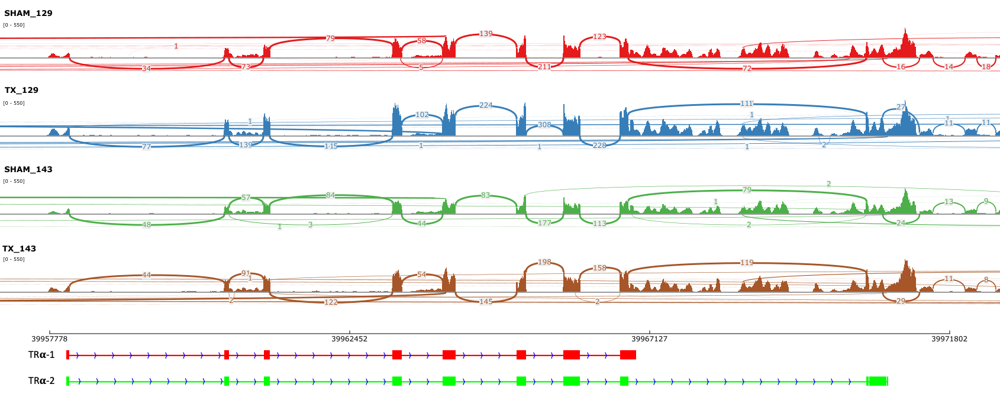

# Thyroid deficiency before birth alters the adipose transcriptome to promote overgrowth of white adipose tissue and impair thermogenic capacity
**Shelley E Harris<sup>1</sup>, Miles J De Blasio<sup>2</sup>, Xiaohui Zhao<sup>3</sup>, Marcella Ma<sup>4</sup>, Katie Davies<sup>2</sup>, FB Peter Wooding FBP<sup>2</sup>, Russell S Hamilton<sup>3</sup>, Dominique Blache<sup>4</sup>, David Meredith<sup>1</sup>, Andrew J Murray<sup>2</sup>, Abigail L Fowden<sup>2</sup> and Alison J Forhead<sup>1,2</sup>**

<sup>1</sup> Department of Biological and Medical Sciences, Oxford Brookes University, Oxford, OX3 0BP, UK
<sup>2</sup> Department of Physiology, Development and Neuroscience, University of Cambridge, Cambridge, CB2 3EG, UK
<sup>3</sup> Centre for Trophoblast Research, University of Cambridge, Cambridge, CB2 3EG, UK
<sup>4</sup> Genomics-Transcriptomics Core, Wellcome Trust-MRC Institute of Metabolic Science, University of Cambridge, Cambridge, CB2 0QQ, UK
<sup>5</sup> School of Animal Biology, University of Western Australia, 6009 Crawley, Australia

## Publication ##
Shelley E Harris, Miles J De Blasio, Xiaohui Zhao, Marcella Ma, Katie Davies, FB Peter Wooding FBP, Russell S Hamilton, Dominique Blache, David Meredith, Andrew J Murray, Abigail L Fowden and Alison J Forhead. (2020) Thyroid deficiency before birth alters the adipose transcriptome to promote overgrowth of white adipose tissue and impair thermogenic capacity <i>xxx </i>, <b>x</b>:x [[DOI]](https://doi.org/1XXX)

## Abstract
Development of adipose tissue before birth is essential for energy storage and thermoregulation in the neonate and for cardiometabolic health in later life.  Thyroid hormones are important regulators of fetal growth and maturation.  Offspring hypothyroid in utero are poorly adapted to regulate body temperature at birth and are at risk of becoming obese and insulin resistant in childhood.  The mechanisms by which thyroid hormones regulate the growth and development of adipose tissue in the fetus, however, are unclear.  The effect of thyroid deficiency (TX) on perirenal adipose tissue (PAT) development was examined in a fetal sheep model during late gestation.  Hypothyroidism in utero resulted in elevated plasma insulin and leptin concentrations and overgrowth of PAT, specifically due to hyperplasia and hypertrophy of unilocular adipocytes with no change in multilocular adipocyte mass.  RNA-sequencing and genomic analyses showed that TX affected 35% of the genes identified in fetal adipose tissue.  Enriched KEGG and gene ontology pathways were associated with adipogenic, metabolic and thermoregulatory processes, insulin resistance, and a range of endocrine and adipocytokine signalling pathways.  Adipose protein levels of signalling molecules, including phosphorylated S6-kinase (pS6K), glucose transporter isoform 4 (GLUT-4) and peroxisome proliferator-activated receptor-γ (PPARγ), were increased and uncoupling protein-1 (UCP1) was decreased by fetal hypothyroidism.  Development of adipose tissue before birth, therefore, is sensitive to thyroid hormone status in utero.  Changes to the adipose transcriptome and phenotype observed in the hypothyroid fetus may have consequences for the risk of obesity and metabolic dysfunction in later life.

## Data Processing
Data were aligned to sheep genome (Oar_v3.1) with STAR (2.5.1b_modified) with --single option. Alignments and QC were processed using custom ClusterFlow (v0.5dev) pipelines and assessed using MultiQC(0.9dev).
Gene quantification was determined with Subread (1.5.0-p2) function featureCounts function. Differential gene expression was performed with DESeq2 package (1.22.2, R 3.5.3) and with the same package read counts were normalised
on the estimated size factors. </bt>

Gene ontology (GO) and KEGG pathway analysis were performed using clusterProfiler (3.10.1).  </bt>

Resource       | URL
-------------- | --------------
Oar_v3.1       | [Link](https://www.ensembl.org/Ovis_aries/Info/Index)
FastQC         | [Link](http://www.bioinformatics.babraham.ac.uk/projects/fastqc/)
Trim_galore    | [Link](http://www.bioinformatics.babraham.ac.uk/projects/trim_galore/)
STAR           | [DOI](https://academic.oup.com/bioinformatics/article/29/1/15/272537)
Feature_Counts | [DOI](http://dx.doi.org/10.1093/bioinformatics/btt656)
ClusterFlow    | [DOI](http://dx.doi.org/10.12688/f1000research.10335.2)
MultiQC        | [DOI](http://dx.doi.org/10.1093/bioinformatics/btw354)
IGV_2.5.2      | [DOI](https://software.broadinstitute.org/software/igv)

## RNA-Seq Isoform analysis for thyroid hormone receptor alpha
As nucleotide sequences for the two THRA isoforms 1 and 2 are not available for sheep, we
utilised the highly similar pig sequences (White &amp; Dauncey, 1999, 10.1677/jme.0.0230241)
to map their genomic positions in the Sheep genome (version Oar_3.1) using BLAT
(https://genome-euro.ucsc.edu/cgi-bin/hgBlat). From the BLAT results a bed12 file was
created to contain the exon positions for the THRA-1 and THRA-2 isoforms.
Individual RNA-Seq alignment files from each of the four groups (SHAM_129, SHAM_143,
TX_129 and TX_143) were merged and loaded into IGV (genome Oar_3.1). A Sashimi plot
was generated for the custom bed12 file for THRA isoforms.


## Scripts to reproduce paper figures and Tables

All files are provides in this repository with the exception of the GTF file for the sheep reference genome. The GTF file can be downloaded from https://www.ensembl.org/Ovis_aries/Info/Index. </bt>

The bash script for align and QC control is named as below.

                                       ClusterFlow_FTSEQ.sh

All the featureCounts files are in the Feature_Counts folder. These scripts can be run interactively in R-studio or as a batch using **Rscripts** by changing the working directory. The *Backstge_Functions_19_07_2019.R* is the useful functions which will be called in the main script *DESeq2_Analysis.R*. </bt>

## MultiQC report
                file:///private/var/folders/hs/hhl4ktj93j72m41qj70hk08h0000gn/T/fz3temp-2/CTR_ajf1005_0001.multiqc_report.html/

## Session Information

Details for the R version and the corresponding used packages to creat all Figures and Tables is given below.

````
R version 3.5.1 (2018-07-02)
Platform: x86_64-apple-darwin15.6.0 (64-bit)
Running under: macOS  10.14.6

Matrix products: default
BLAS: /Library/Frameworks/R.framework/Versions/3.5/Resources/lib/libRblas.0.dylib
LAPACK: /Library/Frameworks/R.framework/Versions/3.5/Resources/lib/libRlapack.dylib

locale:
[1] en_GB.UTF-8/en_GB.UTF-8/en_GB.UTF-8/C/en_GB.UTF-8/en_GB.UTF-8

attached base packages:
 [1] grid      stats4    parallel  stats     graphics  grDevices utils    
 [8] datasets  methods   base     

other attached packages:
 [1] ComplexHeatmap_2.1.0        UpSetR_1.4.0               
 [3] ggalt_0.4.0                 ggthemes_4.2.0             
 [5] calibrate_1.7.2             MASS_7.3-51.4              
 [7] dplyr_0.8.3                 plyr_1.8.4                 
 [9] biomaRt_2.38.0              reshape2_1.4.3             
[11] ggrepel_0.8.1               pheatmap_1.0.12            
[13] cowplot_1.0.0               gplots_3.0.1.1             
[15] RColorBrewer_1.1-2          ggplot2_3.2.0              
[17] DESeq2_1.22.2               SummarizedExperiment_1.12.0
[19] DelayedArray_0.8.0          BiocParallel_1.16.6        
[21] matrixStats_0.54.0          ensembldb_2.6.8            
[23] AnnotationFilter_1.6.0      GenomicFeatures_1.34.8     
[25] GenomicRanges_1.34.0        GenomeInfoDb_1.18.2        
[27] circlize_0.4.6              AnnotationHub_2.14.5       
[29] pathview_1.22.3             org.Hs.eg.db_3.7.0         
[31] enrichplot_1.2.0            org.Bt.eg.db_3.7.0         
[33] rgdal_1.4-4                 sp_1.3-1                   
[35] UniProt.ws_2.22.0           RCurl_1.95-4.12            
[37] bitops_1.0-6                RSQLite_2.1.2              
[39] GEOquery_2.50.5             GSEABase_1.44.0            
[41] graph_1.60.0                annotate_1.60.1            
[43] XML_3.98-1.20               AnnotationDbi_1.44.0       
[45] IRanges_2.16.0              S4Vectors_0.20.1           
[47] Biobase_2.42.0              BiocGenerics_0.28.0        
[49] DOSE_3.8.2                  clusterProfiler_3.10.1     

````

## SampleTable

                                      SampleTable.csv
## Links
Description   | URL
------------- | ----------
Raw Data      | ArrayExpress EMBL-EBI [E-MTAB-8396](https://www.ebi.ac.uk/arrayexpress/experiments/E-MTAB-8396)
CTR Bioinformatics | [CTR-BFX](https://www.trophoblast.cam.ac.uk/Resources/BioInformatics)

## Contact
Contact Xiaohui Zhao (xz289@cam.ac.uk) and Russell S. Hamilton (rsh46@cam.ac.uk) for bioinformatics related queries.
